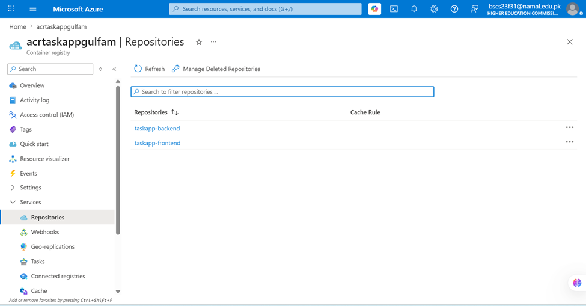
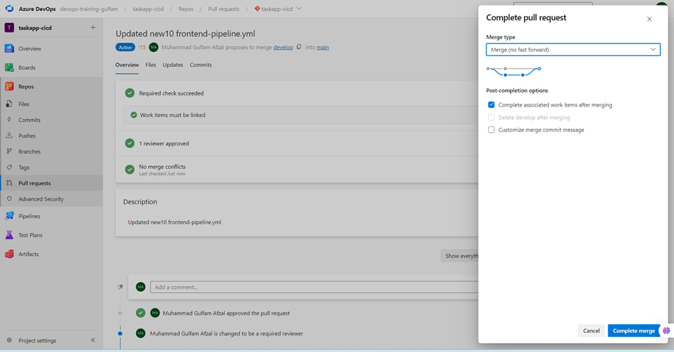

# Enterprise Three-Tier Application with Azure AD B2C Authentication

An enterprise-grade reference architecture demonstrating the implementation of **Azure Active Directory B2C (Azure AD B2C)** for secure identity management across a decoupled three-tier system. This project features a React frontend, an Express backend REST API, and a persistent Azure SQL Database layer with fully automated Git-driven CI/CD operations.

---

## 1. Application Overview

This application serves as a production-ready blueprint for configuring unified authentication handshake boundaries between modern single-page applications (SPAs) and microservice layers. 

### 1.1 Infrastructure Architecture
The diagram below maps out the production topology, including external identity providers and traffic flow mechanics across decoupled cloud tiers:



1. **Azure Static Web Apps (SWA):** Serves the optimized, static React frontend over a global CDN footprint.
2. **Azure App Service (Linux Web Apps):** Hosts the production-optimized NodeJS Express REST API container.
3. **Azure SQL Database:** Acts as the managed relational data persistence engine for employee tracking records.
4. **Azure AD B2C Tenant:** Serves as the central Identity Provider (IdP) managing token signatures, user profiles, and login flows.
5. **GitHub Actions:** Provides dedicated automation matrices handling continuous build, compliance checks, and target service compilation.

### 1.2 Authentication Topology & App Registrations
The logical token exchange path and application boundary setup follow standard OAuth 2.0 Authorization Code Flows with PKCE:



---

## 2. Prerequisites & Development Requirements

Before running setup scripts or launching local runtimes, ensure your target environments fulfill the following matrices:

| Requirement Group | Target Platform | Dependencies / Specific Components |
| :--- | :--- | :--- |
| **Identity Control** | Azure AD B2C | Active tenant, UI App registration, API App registration, `B2C_1_Sign_Up_Sign_In` User Flow |
| **Host Substrate** | Microsoft Azure | Active subscription with authorization to allocate Static Web Apps, App Services, and SQL servers |
| **Relational Data** | Azure SQL Server | A logical server provisioning a Free/Basic compute layer |
| **Local Runtime** | Node.js Environment | Node.js `v18.x` or higher with stable `npm` package manager binaries |
| **Tooling & IDE** | Visual Studio Code | Extensions: *Azure Account*, *Azure App Service*, *Azure Static Web Apps* |

---

## 3. Repository Directory Structure

```text
├── .github/workflows/
│   ├── azure-static-web-apps-delightful-pebble-0bec84b00.yml  # Frontend SWA CD matrix
│   └── main_swa-api-sql-api.yml                               # Backend Web App App-Service CD matrix
└── src/
    ├── 1-database/
    │   └── setup.sql                                          # Primary database initialization schemas
    ├── 2-api/
    │   ├── api.js                                             # Express application framework core engine
    │   └── package.json                                       # Server runtime dependency controls
    └── 3-swa/
        ├── public/                                            # Public assets
        ├── src/                                               # React SPA component code tree
        └── package.json                                       # Client application dependency controls

```

---

## 4. Architectural Deep Dive & Key Components

### 4.1 Express Backend API

* **Dynamic JWKS Evaluation:** Intercepts incoming bearer tokens and validates signatures via real-time JSON Web Key Sets hosted at the tenant discovery endpoint.
* **Route Isolation:** Employs explicit routing middleware to guard restricted resources from unauthenticated requests.

#### Production JWT Configuration Hook (`src/2-api/api.js`)

```javascript
const authenticateToken = jwt({
  secret: jwksRsa.expressJwtSecret({
    cache: true,
    rateLimit: true,
    jwksUri: `https://${config.b2cTenant}.b2clogin.com/${config.b2cTenant}.onmicrosoft.com/${config.b2cPolicy}/discovery/v2.0/keys`
  }),
  audience: `${config.audience}`,
  issuer: `https://${config.b2cTenant}.b2clogin.com/${config.tenantId}/v2.0/`,
  algorithms: ['RS256']
});

```

### 4.2 React Frontend SPA

* **Microsoft Authentication Library (MSAL):** Natively manages token lifetimes, token acquisition silent frames, and secure redirection handshakes.
* **Decoupled API Scopes:** Attaches explicit verification permission scopes to requests targeting the application server endpoints.

#### MSAL & Application Property Structure (`src/3-swa/src/config.js`)

```javascript
export const msalConfig = {  
    auth: {  
        clientId: process.env.REACT_APP_CLIENT_ID, 
        authority: process.env.REACT_APP_AUTHORITY, 
        redirectUri: process.env.REACT_APP_REDIRECT_URI, 
        knownAuthorities: [process.env.REACT_APP_KNOWN_AUTHORITIES], 
        postLogoutRedirectUri: process.env.REACT_APP_POST_LOGOUT_REDIRECT_URI, 
    },  
};  

export const appConfig = {  
    apiRootUrl: process.env.REACT_APP_API_ROOT_URL, 
    loginRequest: {  
        scopes: process.env.REACT_APP_SCOPES.split(' '), 
    },  
};

```

---

## 5. Configuration Matrices (`.env` Outlines)

Create structured `.env` configuration runtime targets inside the decoupled directory layers before initiating runtime contexts.

### 5.1 Client Directory Layer (`src/3-swa/.env`)

```env
REACT_APP_CLIENT_ID=00000000-0000-0000-0000-000000000000
REACT_APP_AUTHORITY=[https://yourtenant.b2clogin.com/yourtenant.onmicrosoft.com/B2C_1_Sign_Up_Sign_In](https://yourtenant.b2clogin.com/yourtenant.onmicrosoft.com/B2C_1_Sign_Up_Sign_In)
REACT_APP_REDIRECT_URI=https://localhost:3000/
REACT_APP_KNOWN_AUTHORITIES=yourtenant.b2clogin.com
REACT_APP_POST_LOGOUT_REDIRECT_URI=https://localhost:3000/
REACT_APP_API_ROOT_URL=http://localhost:5000
REACT_APP_SCOPES=[https://yourtenant.onmicrosoft.com/swa-api/Employees.Read](https://yourtenant.onmicrosoft.com/swa-api/Employees.Read)

```

> [!NOTE]
> React compilation captures environment states at build time. During production automation runs, inject these values using repository variable tokens inside your deployment workflow steps.

### 5.2 Server Directory Layer (`src/2-api/.env`)

```env
AUTHORITY=[yourtenant.b2clogin.com/yourtenant.onmicrosoft.com/B2C_1_Sign_Up_Sign_In](https://yourtenant.b2clogin.com/yourtenant.onmicrosoft.com/B2C_1_Sign_Up_Sign_In)
CLIENT_ID=00000000-0000-0000-0000-000000000000
DB_SERVER=your-sql-logical-server.database.windows.net
DB_DATABASE=your-target-database-name
DB_USER=cloud-infrastructure-admin
DB_PASSWORD=your-secure-database-password

```

---

## 6. Local Setup & Execution Guide

### 6.1 Database Schema Initialization

Connect to your target SQL workspace using an active terminal client or SQL Server Management Studio (SSMS) and run the initialization script:

```bash
sqlcmd -S your-sql-logical-server.database.windows.net -d your-db -U admin -P password -i src/1-database/setup.sql

```

### 6.2 Service Dependency Compilation

Install required node packages sequentially for both the API layers and client view architectures:

```bash
# Compile Server Engine Dependencies
cd src/2-api
npm install

# Compile Client SPA Dependencies
cd ../3-swa
npm install

```

### 6.3 Launching the Application Locally

Run backend processes and local UI development servers simultaneously using distinct terminal runtime slots:

```bash
# Execute Express API Server Session (From src/2-api)
npm start

# Execute React Local Interface Dev Tooling (From src/3-swa)
npm start

```

---

## 7. Cloud Deployment & CI/CD Strategy

### 7.1 Infrastructure Provisioning via Azure CLI

Execute targeted terminal sequences to standing up resources inside identical cloud resource contexts:

```bash
# Provision an Azure Static Web App endpoint for the Client
az staticwebapp create \
  --name swa-client-prod \
  --resource-group rg-enterprise-apps \
  --location eastus2 \
  --sku Free \
  --app-location "src/3-swa"

# Provision a continuous node compute slot for the REST API
az webapp up \
  --name api-server-prod \
  --resource-group rg-enterprise-apps \
  --location eastus2 \
  --sku B1 \
  --runtime "NODE|18-lts"

```

### 7.2 CI/CD Automation Matrix Flow

Continuous integration processes automatically build code changes and deliver application updates:

When changes push to the tracking project, twin workflows kick off to build and deploy each tier independently:

#### Frontend Deployment Matrix

* **Verification Pipelines:** GitHub Actions monitor your source branches, catching broken configurations or compilation errors before shipping.
* **Production Build Actions:** The static content action automatically packages clean React production builds (`npm run build`), pushing assets directly onto target global CDN web paths securely.
* **API Delivery Matrices:** Server zip containers safely route over automated pipelines using deployment tokens, preventing external visibility into environment configuration keys.

---

## 8. Technical Resources & Documentation Manuals

* [Azure Static Web Apps Engineering Documentation](https://docs.microsoft.com/en-us/azure/static-web-apps/)
* [Azure App Service Platform Operation Manuals](https://docs.microsoft.com/en-us/azure/app-service/)
* [Azure AD B2C Product and Configuration Guides](https://docs.microsoft.com/en-us/azure/active-directory-b2c/)
* [Microsoft Authentication Library (MSAL) for JS Reference Engines](https://www.google.com/search?q=https://learn.microsoft.com/en-us/javascript/api/overview/msal-overview)